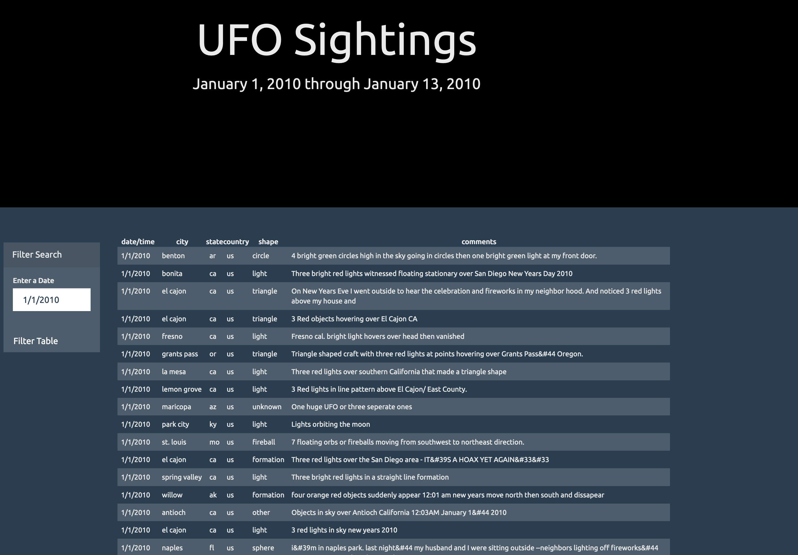

# JavaScript and DOM Manipulation

## File Table of Contents
  * index.html: This file contains the code for the UFO Sightings webpage.
  * data.js: This file contains the data used for this project.
  * app.js: This file contains the Javascript that makes the filtering possible. It includes the ncessary code to create a new table once a date is entered, and the filter table button is "clicked".
  * stlye.css: This file contains the code used to style the html using css.

## Project Scope
For this project, I will be writing code that will create a table based an existing data set that will be filtered based upon a user's input. In particular, for this application, the usere will enter a date, and then a table will be generated based on what UFO sitings were reported on that particular day. Below is a list of task that were successfully completed in order to make this application work.

  - Updated the code in index.html file that was provided to allow for the new table to be built.
  - Accessed the data that was provided using D3 to prepare the js code that appends a table to the webpage and adds new rows of data for each UFO sighting based on searching through the "datetime" column in provided data.js file.
  - Once this data is searched, a handleClick function will filter the table and  a table will be generated that will include `date/time`, `city`, `state`, `country`, `shape`, and `comment`.

 
 